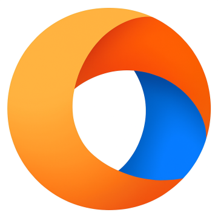
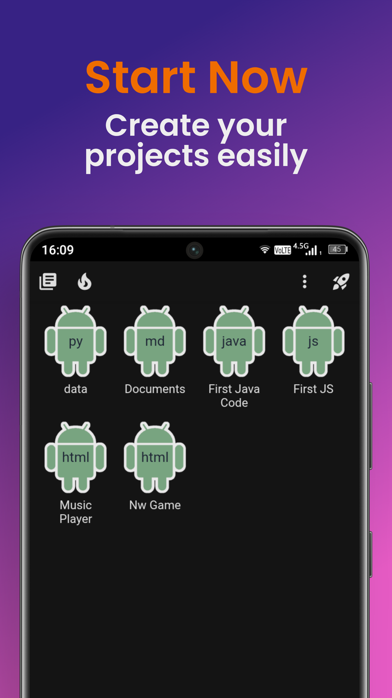
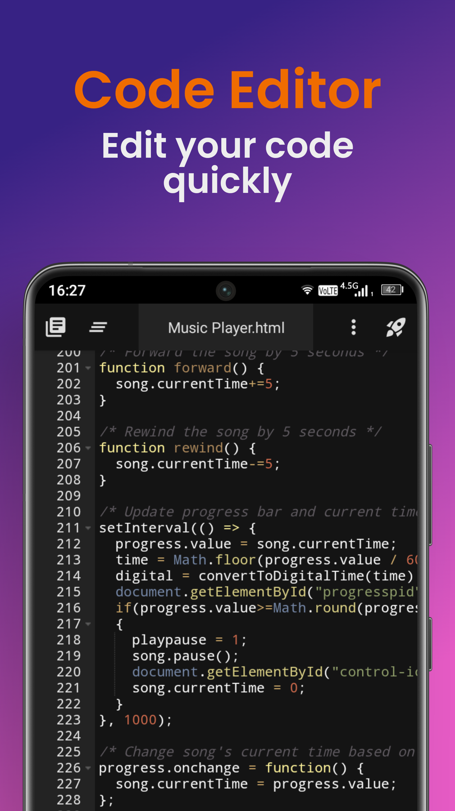
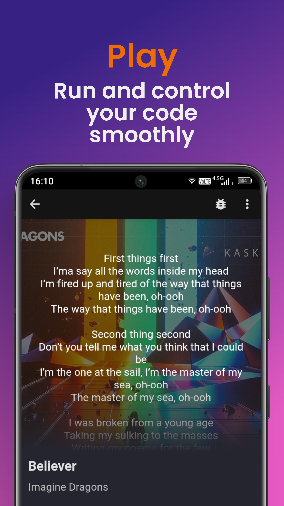
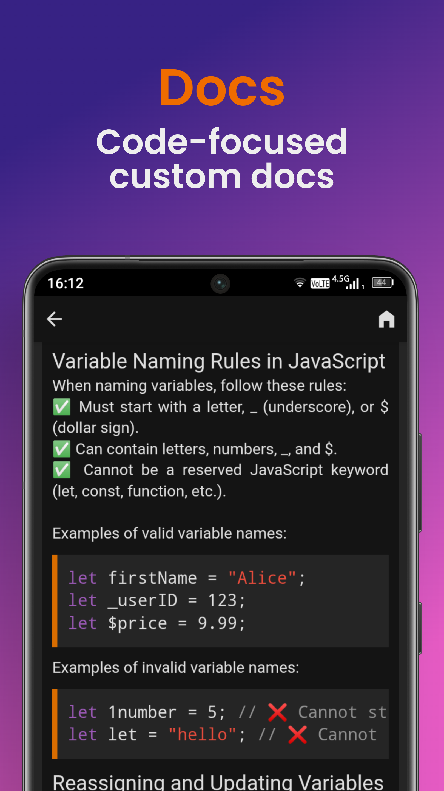
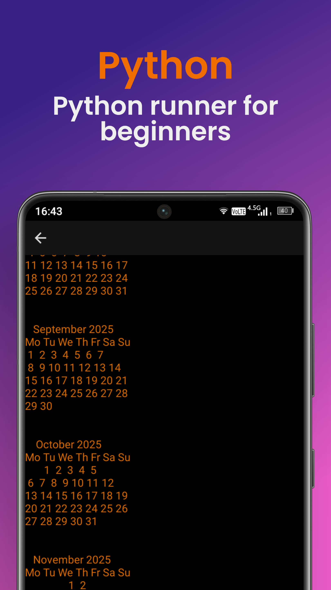
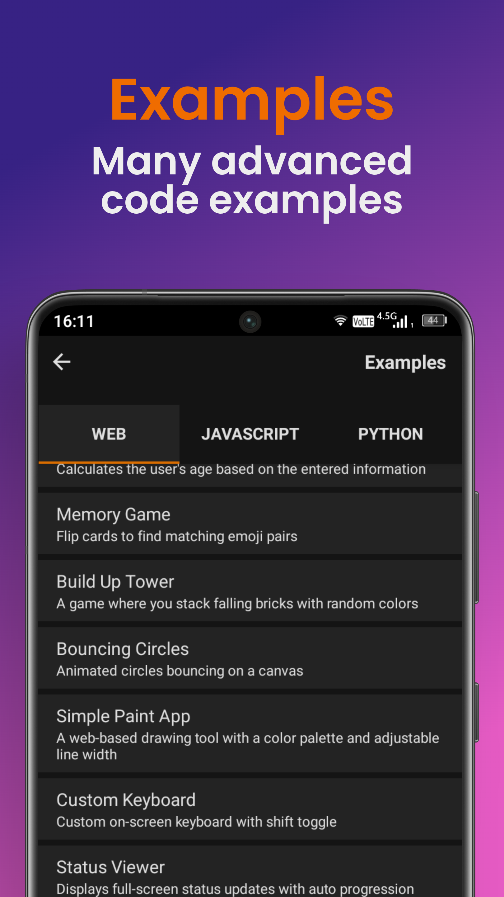

# CodeFlash - Powerful Mobile Code Editor for Android

CodeFlash is a fast, offline, and powerful code editor designed specifically for Android devices. It provides a professional coding experience on your mobile device with support for 200+ programming languages, advanced features, and a clean, distraction-free interface.

## Features ✨

- **Mobile-Optimized**: Comfortable coding experience on phones and tablets
- **200+ Language Support**: Syntax highlighting for HTML, CSS, JavaScript, Python, Java, C++, and more
- **Offline Documentation**: Built-in coding references and tutorials
- **Customizable Interface**: Themes, font sizes, and keyboard settings
- **Run & Preview**: Execute and view outputs of HTML/CSS, JS, Python, and more
- **Lightweight**: Smooth performance even with large files
- **Project Management**: File organization and version history

## Download 📥

Get CodeFlash on Google Play:

## Screenshots 📸

| | | |
|:-------------------------:|:-------------------------:|:-------------------------:|
|  |  |  |
|  |  |  |

## Technologies Used 🛠️

- **Frontend**: HTML5, CSS3, JavaScript
- **Icons**: Font Awesome
- **Hosting**: GitHub Pages

## Contributing 🤝

Contributions are welcome! If you'd like to improve the website:

1. Fork the repository
2. Create your feature branch (`git checkout -b feature/AmazingFeature`)
3. Commit your changes (`git commit -m 'Add some AmazingFeature'`)
4. Push to the branch (`git push origin feature/AmazingFeature`)
5. Open a Pull Request

## License 📄

This project is licensed under the MIT License - see the [LICENSE](LICENSE) file for details.

## Contact 📧

For support or questions: [alonewolfsupp@gmail.com](mailto:alonewolfsupp@gmail.com)